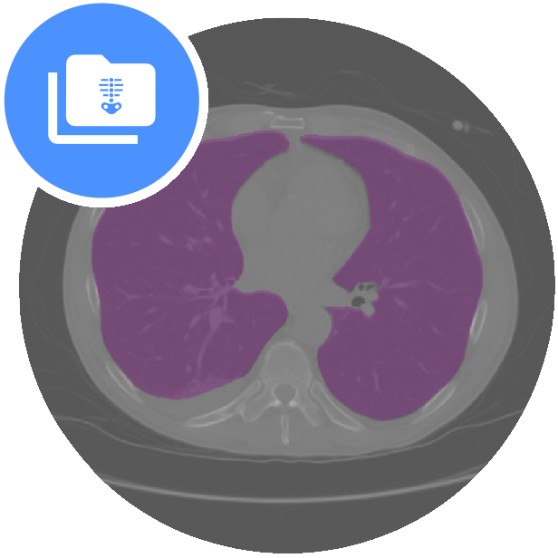
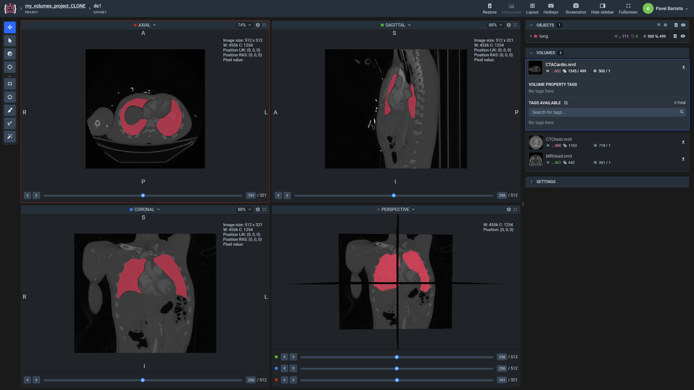
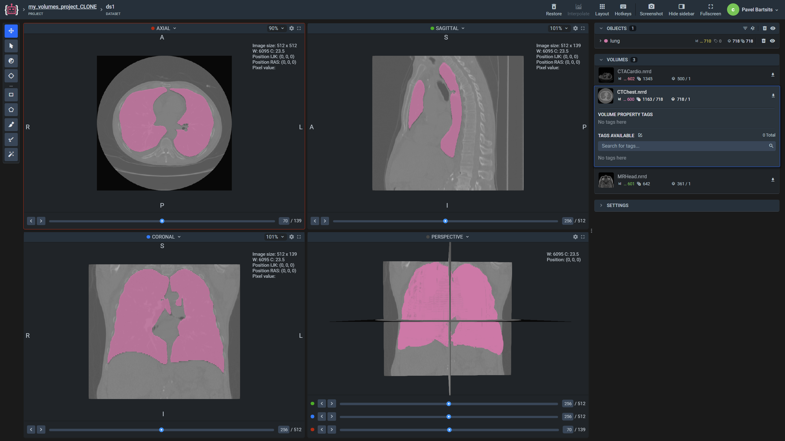
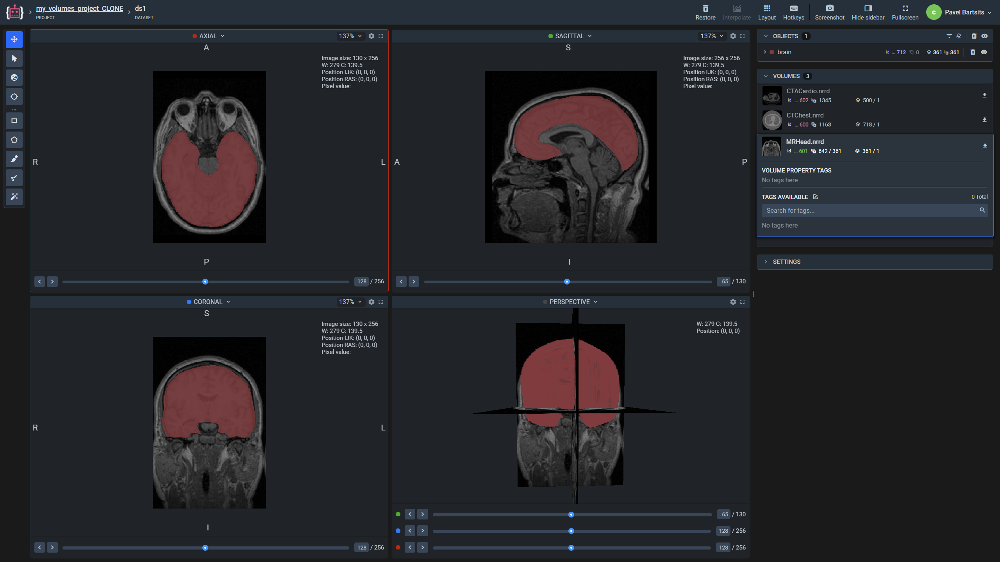

 

  

 

# Demo Volumes Annotated  

  <a href="#overview">Overview</a> •
  <a href="#download">Download</a> •
  <a href="#statistics">Statistics</a>

 

Demo project with dicom / nrrd volumes with labels
## Overview 

`demo_volumes_annotated` is an example project with 3 labeled volumes. 
Volumes for this project were acquired via [3D Slicer](https://www.slicer.org/) application.

Included volumes:
* CTACardio
* CTChest
* MRHead

  <table>
    <tr style="width: 100%">
      <td>
        <b>CTACardio.nrrd</b>
        
      </td>
      <td>
        <b>CTChest.nrrd</b>
        
      </td>
      <td>
        <b>MRHead.nrrd</b>
        
      </td>
    </tr>
  </table>

## Download

Direct download: [zip archive](https://cloud.enterprise.supervise.ly/f/906646) (115,3 MB).

## Statistics

Project contains 1 dataset with 3 volumes in it, with annotations.
